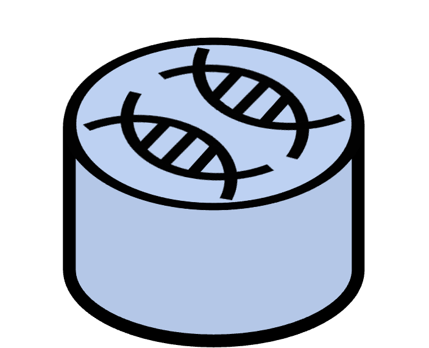
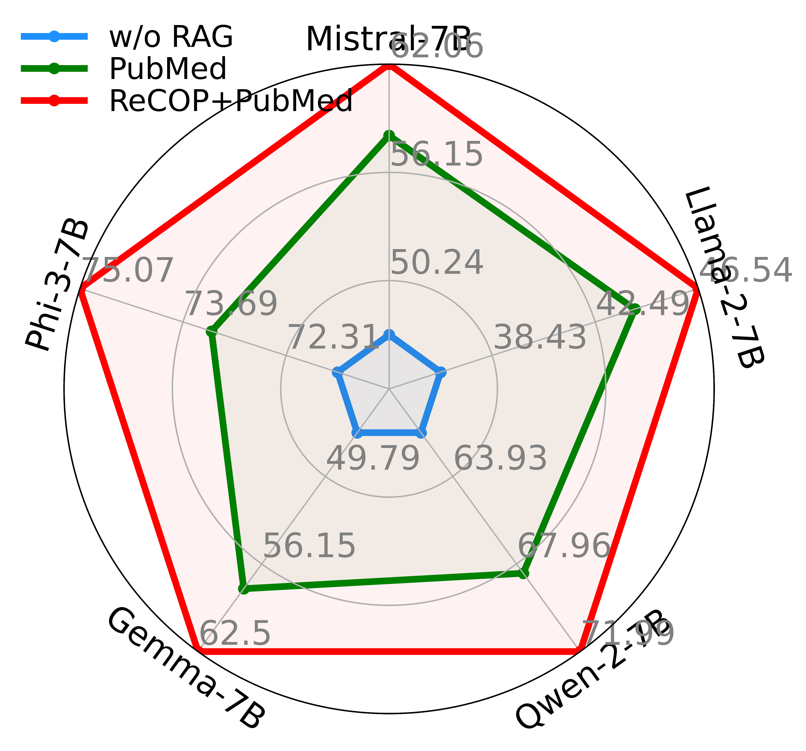
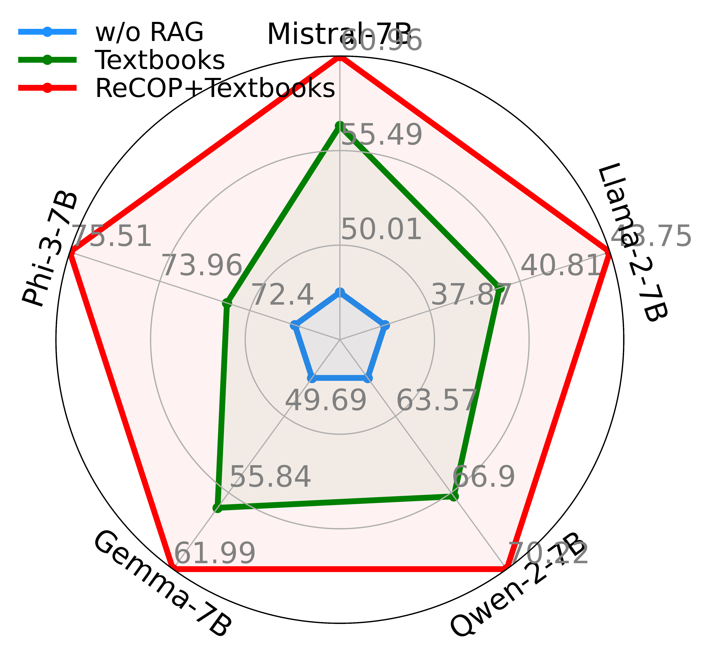
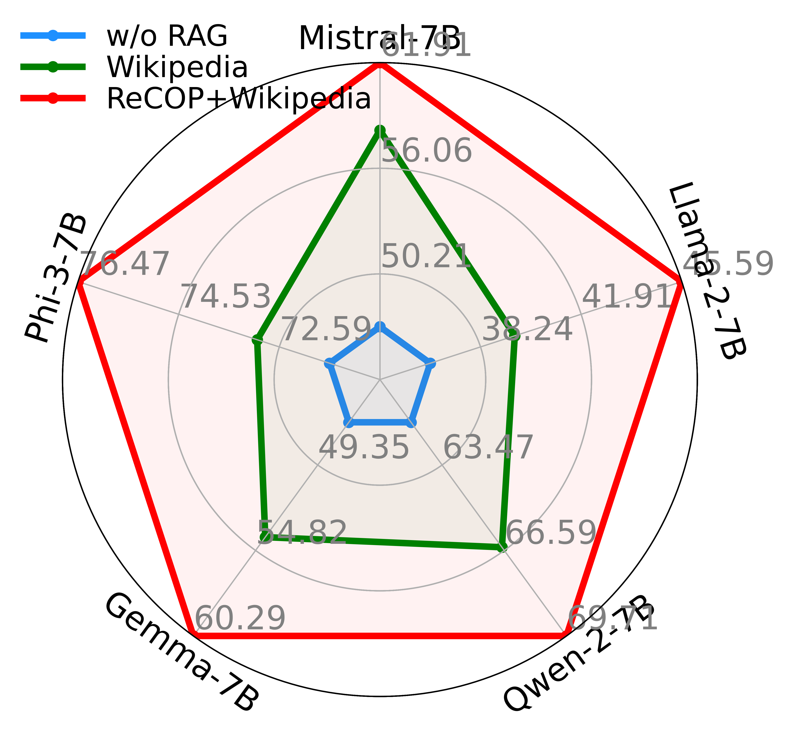

# Assessing and Enhancing Large Language Models in Rare Disease Question-answering 


This is the official codebase of paper _Assessing and Enhancing Large Language Models in Rare Disease Question-answering_.


## Resources
:star2: Please star our repo to follow the latest updates on ReDis-QA-Bench!

:mega: We have released our [paper]() and source code of ReDis-QA-Bench!

:orange_book: We have released our benchmark dataset [ReDis-QA]()!

:closed_book: We have released our corpus for RAG [ReCOP]() !

:blue_book: Baseline corpus refers to [PubMed](https://huggingface.co/datasets/MedRAG/pubmed), [Textbook](https://huggingface.co/datasets/MedRAG/textbooks), [Wikipedia](https://huggingface.co/datasets/MedRAG/wikipedia) and [StatPearls](https://huggingface.co/datasets/MedRAG/statpearls)!


## Dataset Overview

ReDis-QA dataset widely covers 205 types of rare diseases, where the most frequent disease features over 100 questions.


ReDis-QA dataset includes 11\%, 33\%, 13\%, 15\%, 18\% of the questions corresponding to the symptoms, causes, affects, related-disorders, diagnosis of rare diseases, respectively. 
The remaining 9\% of the questions pertain to other properties of the diseases.


## Dependency
```
numpy
scikit-learn
scipy
torch
accelerate==0.32.1
transformers==4.42.4
datasets==2.20.0
ipdb
tqdm
```

## Quick Exploration on the Benchmark

Run LLMs w/o RAG on the ResDis-QA dataset:
```bash
cd zero-shot-bench
bash ./scripts/run_exp.sh
```

The accuracy of LLMs on each subset of properties is shown as follows:


Run RAG with ReCOP corpus on the ResDis-QA dataset:
```bash
cd meta-data-bench
bash ./scripts/run_exp.sh
```

The accuracy of RAG with ReCOP corpus is shown as follows:

&nbsp;&nbsp;&nbsp;

Run RAG with baseline corpus and combine with ReCOP on the ResDis-QA dataset:
```bash

```

&nbsp;&nbsp;&nbsp;

## Acknowledgement

The MedCPT, BM25 retrievers, and baseline corpus are sourced from the opensource repo [MedRAG](https://github.com/Teddy-XiongGZ/MedRAG). 
Thanks to their contributions to the community!

## Cite This Work

If you find this work useful, you may cite this work:

@article{
    year={2024}
}