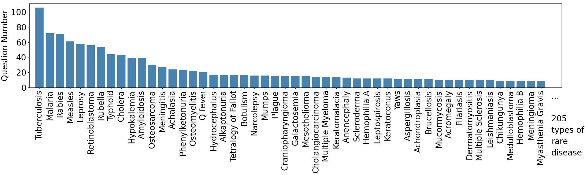
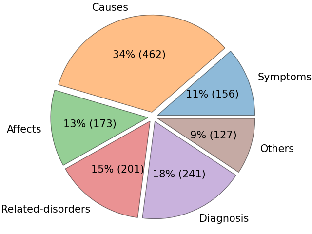
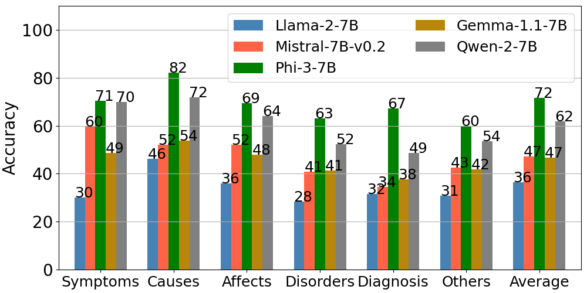

# Assessing and Enhancing Large Language Models in Rare Disease Question-answering

This is the official codebase of paper _Assessing and Enhancing Large Language Models in Rare Disease Question-answering_.

## Dataset Overview



&nbsp;


## Dependency
```
numpy
scikit-learn
scipy
torch
accelerate==0.32.1
transformers==4.42.4
datasets==2.20.0
ipdb
tqdm
```

## Quick Exploration on the Benchmark

Run LLMs w/o RAG on the ResDis-QA dataset:
```bash
cd zero-shot-bench
bash ./scripts/run_exp.sh
```

Run RAG with ReCOP corpus on the ResDis-QA dataset:
```bash
cd meta-data-bench
bash ./scripts/run_exp.sh
```


