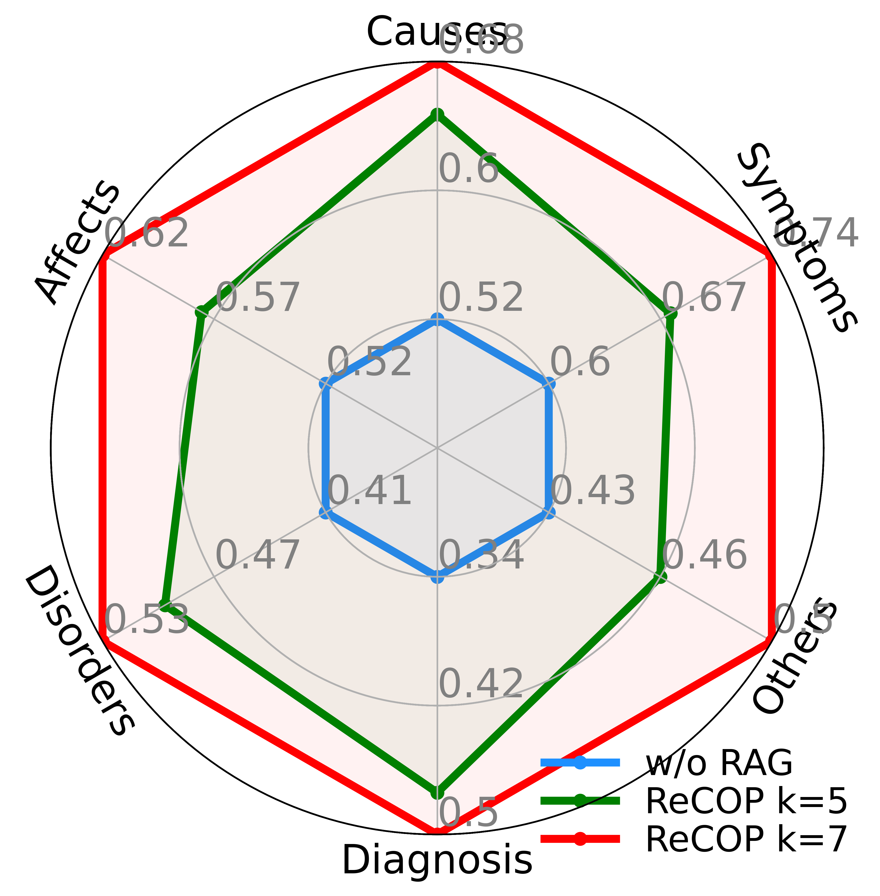
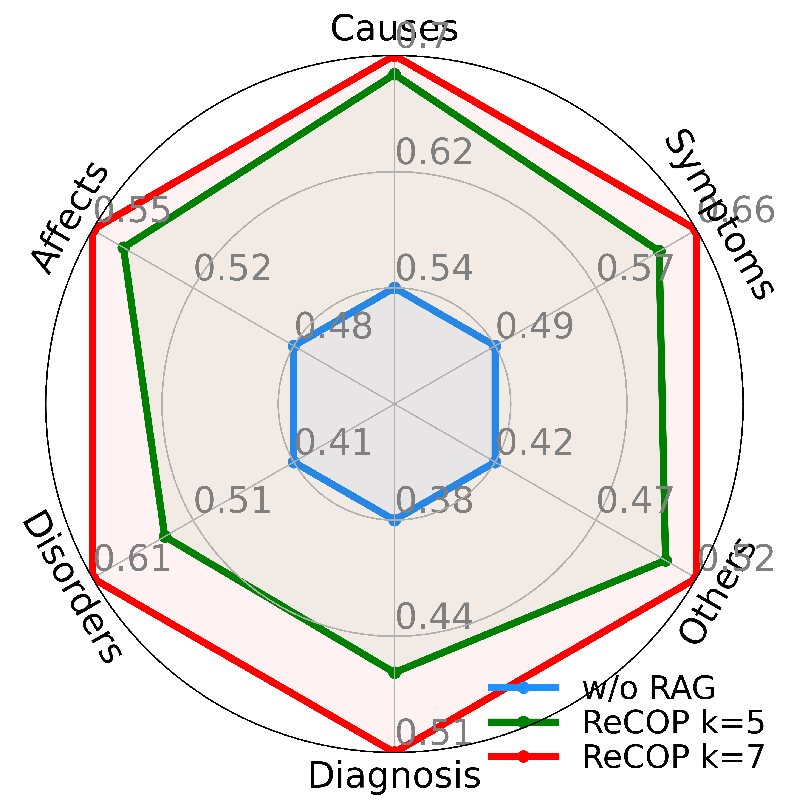
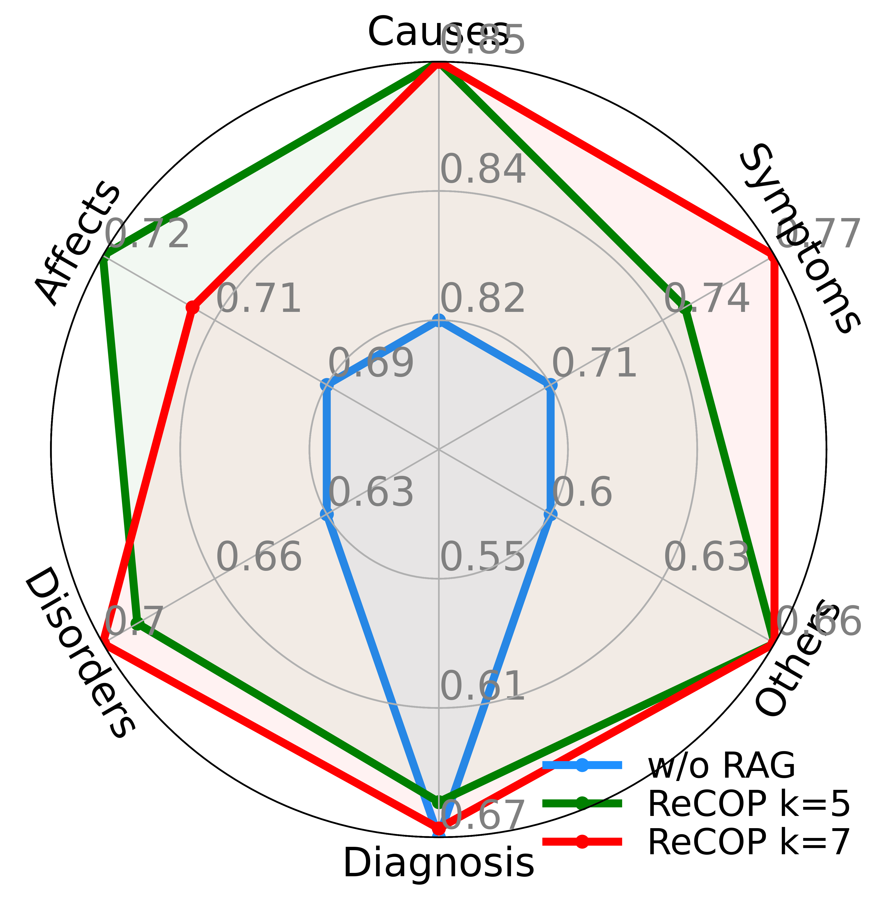
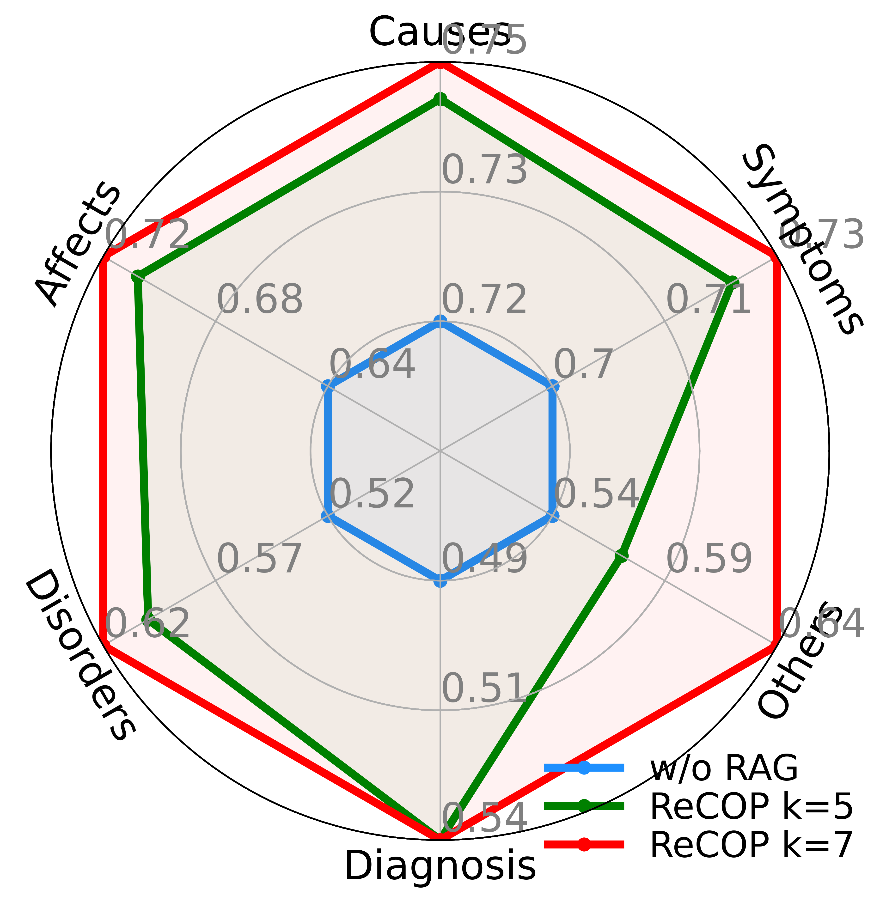

# Assessing and Enhancing Large Language Models in Rare Disease Question-answering

This is the official codebase of paper _Assessing and Enhancing Large Language Models in Rare Disease Question-answering_.

## Dataset Overview

ReDis-QA dataset widely covers 205 types of rare diseases, where the most frequent disease features over 100 questions.


ReDis-QA dataset includes 11\%, 33\%, 13\%, 15\%, 18\% of the questions corresponding to the symptoms, causes, affects, related-disorders, diagnosis of rare diseases, respectively. 
The remaining 9\% of the questions pertain to other properties of the diseases.


## Dependency
```
numpy
scikit-learn
scipy
torch
accelerate==0.32.1
transformers==4.42.4
datasets==2.20.0
ipdb
tqdm
```

## Quick Exploration on the Benchmark

Run LLMs w/o RAG on the ResDis-QA dataset:
```bash
cd zero-shot-bench
bash ./scripts/run_exp.sh
```

The accuracy of LLMs on each subset of properties is shown as follows:


Run RAG with ReCOP corpus on the ResDis-QA dataset:
```bash
cd meta-data-bench
bash ./scripts/run_exp.sh
```

The accuracy of RAG with ReCOP corpus is shown as follows:







